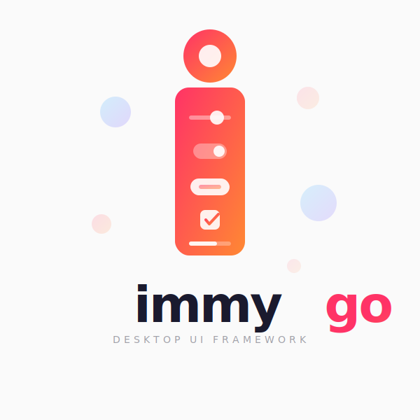

<p align="center">
  
</p>

# ImmyGo

visit the website at https://immygo.app

**AI-first Go UI framework.** Describe what you want, and ImmyGo builds it. A high-level framework built on [Gio](https://gioui.org) with [Fluent Design](https://fluent2.microsoft.design/) aesthetics and local AI capabilities via [Yzma](https://github.com/hybridgroup/yzma), Ollama and Anthropic API.

## Build UIs with AI

ImmyGo is designed to work *with* AI from the start. Scaffold entire apps from a description, generate UI at runtime, or use the MCP server to let Claude Code and Cursor write ImmyGo code with full API context.

### Scaffold a Project with AI

```bash
# Generate a complete app from a natural language description
immygo new myapp --ai "a todo list with add, delete, and mark complete"
immygo new myapp --ai "a calculator with basic arithmetic operations"
immygo new myapp --ai "a dashboard with sidebar navigation and charts"
```

The AI generates a complete `main.go` with proper state management, layout, and event handling — ready to `go run`.

### Conversational Dev Mode

```bash
# Start live-reload dev server with an AI assistant
immygo dev --ai ./myapp/
```

Describe changes in natural language and watch them appear:

```
ai> add a dark mode toggle in the top right corner
  Generating... Code updated — rebuilding...

ai> replace the list with a data grid that has Name, Email, Status columns
  Generating... Code updated — rebuilding...
```

### Runtime UI Prototyping

Generate UI from a description at runtime — explore ideas without writing code:

```go
ui.Run("Prototype", func() ui.View {
    return ui.Prototype("a settings page with dark mode toggle and font size slider")
})
```

Call `.Eject()` to print the generated Go source code when you're ready to keep it.

### MCP Server for AI Tools

Expose ImmyGo's full API reference and code generation to Claude Code, Cursor, and other AI editors:

```bash
immygo mcp
```

Add to your `.mcp.json`:
```json
{
  "mcpServers": {
    "immygo": {
      "command": "go",
      "args": ["run", "./cmd/immygo", "mcp"]
    }
  }
}
```

Three tools: `immygo_widget_catalog` (API reference), `immygo_generate_code` (code from description), `immygo_search_docs` (search docs).

### Live Reload

Edit code and see changes instantly — no manual restart:

```bash
immygo dev ./myapp/
```

The dev server watches your files, rebuilds on save, and restarts the app automatically. Pair it with `--ai` for AI-assisted development.

### Layout Debugger

Inspect every widget's constraints and rendered size at runtime:

```bash
IMMYGO_DEBUG=1 go run ./myapp/
```

Prints a JSON tree of the entire layout hierarchy to stderr — showing min/max constraints and actual sizes for every widget. Add AI-powered analysis of layout issues:

```bash
IMMYGO_DEBUG=1 IMMYGO_DEBUG_AI=1 go run ./myapp/
```

Or enable programmatically:

```go
ui.EnableDebug()
```

---

## Getting Started

### Install

```bash
go get github.com/amken3d/immygo
```

Or scaffold with the CLI:

```bash
# Default template
immygo new myapp

# AI-generated from description
immygo new myapp --ai "a todo list with add and delete"
```

### System Dependencies

- **Linux (Debian/Ubuntu):** `sudo apt install libwayland-dev libxkbcommon-x11-dev libgles2-mesa-dev libegl1-mesa-dev libx11-xcb-dev libvulkan-dev`
- **macOS:** `xcode-select --install`
- **Windows:** No additional dependencies

### CLI Tool

```bash
immygo new <name>              # Scaffold a new project
immygo new <name> --ai "desc"  # AI-generated scaffold
immygo dev [path]              # Live-reload dev server
immygo dev --ai [path]         # Dev server + AI assistant
immygo mcp                     # MCP server for AI editors
```

---

## Two API Levels

ImmyGo offers a declarative API (recommended) and a lower-level API for full Gio control.

### Declarative API

```go
package main

import (
    "fmt"

    "github.com/amken3d/immygo/ui"
)

func main() {
    count := ui.NewState(0)

    ui.Run("My App", func() ui.View {
        return ui.Centered(
            ui.VStack(
                ui.Text(fmt.Sprintf("Count: %d", count.Get())).Title(),
                ui.Button("+1").OnClick(func() {
                    count.Update(func(n int) int { return n + 1 })
                }),
            ).Spacing(12),
        )
    })
}
```

No `layout.Context`. No `layout.Dimensions`. No closure wrapping. Just views.

### Lower-Level API

```go
package main

import (
    "gioui.org/layout"

    "github.com/amken3d/immygo/app"
    immylayout "github.com/amken3d/immygo/layout"
    "github.com/amken3d/immygo/theme"
    "github.com/amken3d/immygo/widget"
)

func main() {
    app.New("My App").
        WithLayout(func(gtx layout.Context, th *theme.Theme) layout.Dimensions {
            return immylayout.NewVStack().WithSpacing(16).
                Child(func(gtx layout.Context) layout.Dimensions {
                    return widget.H1("Hello, ImmyGo!").Layout(gtx, th)
                }).
                Child(func(gtx layout.Context) layout.Dimensions {
                    return widget.NewButton("Click Me").
                        WithOnClick(func() { println("clicked!") }).
                        Layout(gtx, th)
                }).
                Layout(gtx)
        }).
        Run()
}
```

---

## Features

### 25+ Widgets

Button, TextField, Toggle, Card, DataGrid, TreeView, Dialog, Drawer, DatePicker, Navigator, Accordion, Snackbar, ContextMenu, TabBar, SideNav, AppBar, Badge, Progress, Slider, RadioGroup, Dropdown, Checkbox, RichText, ListView, Tooltip, Icon (32 built-in), Image.

### Smooth Animations

Every widget animates automatically — buttons transition on hover/press with ripple, toggles slide, cards lift on hover, drawers slide in/out, accordions expand smoothly, pages transition with slide/fade.

### Reactive State

```go
count := ui.NewState(0)
count.Set(5)
count.Update(func(n int) int { return n + 1 })

doubled := ui.Computed(count, func(n int) int { return n * 2 })
```

### Fluent Design Theming

Built-in light and dark themes with semantic tokens. Runtime theme switching:

```go
themeRef := ui.NewThemeRef(theme.FluentLight())
darkMode := ui.Toggle(false).OnChange(func(on bool) {
    if on { themeRef.Set(theme.FluentDark()) } else { themeRef.Set(theme.FluentLight()) }
})
ui.Run("App", build, ui.WithThemeRef(themeRef))
```

### Responsive Layouts

```go
ui.Responsive(
    ui.At(0, mobileLayout),
    ui.At(600, tabletLayout),
    ui.At(1024, desktopLayout),
)
```

### Page Navigation

```go
nav := ui.Navigator().
    Route("home", homePage).
    Route("settings", settingsPage).
    Transition(ui.TransitionSlide)
nav.Push("settings") // slides in from right
nav.Pop()            // slides back
```

### Data Tables

```go
ui.DataGrid(ui.Col("Name"), ui.Col("Email"), ui.Col("Role")).
    AddRow("Alice", "alice@example.com", "Admin").
    AddRow("Bob", "bob@example.com", "User").
    OnRowSelect(func(i int) { ... })
```

### Local AI Chat

Add local LLM capabilities with zero API keys:

```go
engine := ai.NewEngine(ai.Config{ModelPath: "model.gguf"})
assistant := ai.NewAssistant("Helper", engine)
chatPanel := ai.NewChatPanel(assistant)
```

### Escape Hatch to Raw Gio

```go
ui.ViewFunc(func(gtx layout.Context, th *theme.Theme) layout.Dimensions {
    return myCustomWidget.Layout(gtx, th)
})
```

---

## Architecture

```
immygo/
├── ui/         Declarative API — zero Gio knowledge required
│   ├── Run(), Text, Button, Input, Toggle, Card, Icon ...
│   ├── VStack, HStack, ZStack, Grid, Flex, Centered, Scroll ...
│   ├── DataGrid, TreeView, Navigator, Drawer, Dialog ...
│   ├── State[T], Computed, Themed(), ViewFunc, Styled ...
│   └── Prototype()   AI-generated UI from descriptions
│
├── widget/     Lower-level controls with Gio Layout() methods
├── layout/     Avalonia-inspired panels (DockPanel, WrapPanel, Grid ...)
├── theme/      Fluent Design tokens, custom fonts, GPU text rendering
├── style/      CSS-like states (Hovered/Pressed/Focused) + animators
├── ai/         Local LLM via Yzma (Engine, Assistant, ChatPanel)
│
├── cmd/immygo/
│   ├── new         Scaffold projects (with optional --ai generation)
│   ├── dev         Live-reload dev server (with optional --ai mode)
│   └── mcp         MCP server for AI editor integration
│
└── examples/
    ├── ui-hello/      Minimal declarative app (29 lines)
    ├── ui-form/       Form with dark mode toggle
    ├── ui-showcase/   Comprehensive widget demo
    ├── todoapp/       CRUD app mixing declarative + ViewFunc
    ├── hello/         Lower-level hello world
    ├── dashboard/     Multi-page dashboard with sidebar
    └── showcase/      Lower-level widget showcase
```

## Examples

```bash
cd examples/ui-showcase && go run .
```

| Example | Description | Lines |
|---------|-------------|-------|
| `examples/ui-hello/` | Centered text + counter button | 29 |
| `examples/ui-form/` | Sign-up form with dark mode toggle | 84 |
| `examples/ui-showcase/` | Full demo: tabs, sliders, icons, badges, dialogs | ~230 |
| `examples/todoapp/` | CRUD todo app mixing declarative + ViewFunc | ~208 |
| `examples/hello/` | Minimal lower-level app | — |
| `examples/dashboard/` | Multi-page dashboard with sidebar | — |
| `examples/showcase/` | Interactive demo of all widget types | — |

## Documentation

- [Getting Started](docs/getting-started.md) — Installation, first app, choosing an API level
- [Widgets Reference](docs/widgets.md) — All controls with declarative and lower-level examples
- [Layouts Guide](docs/layouts.md) — Declarative and panel-based layout composition
- [Theming Guide](docs/theming.md) — Colors, typography, custom themes, runtime switching
- [AI Integration](docs/ai.md) — AI scaffolding, MCP server, dev tools, prototyping

## Design Principles

1. **AI-first** — Scaffold apps from descriptions, generate UI at runtime, MCP server for AI editors
2. **Beautiful by default** — Fluent Design theme with proper spacing, typography, and elevation
3. **Easy to learn** — Declarative API requires zero Gio knowledge; lower-level API for full control
4. **Composable** — Mix declarative views and raw Gio freely via ViewFunc
5. **Go-idiomatic** — Builder pattern, explicit state, no magic

## License

MIT

## Development Notes
This project was built with significant AI assistance (primarily Claude Opus4.6 by Anthropic) for code generation, documentation, and scaffolding. Architecture, design decisions, hardware domain knowledge, and review are my own. I’m a solo founder shipping across embedded hardware, firmware, and desktop software — AI-assisted development is core to how I work at that breadth.
ImmyGo itself is designed to be AI-first, so this is consistent with the project’s own philosophy rather than something to hide.
